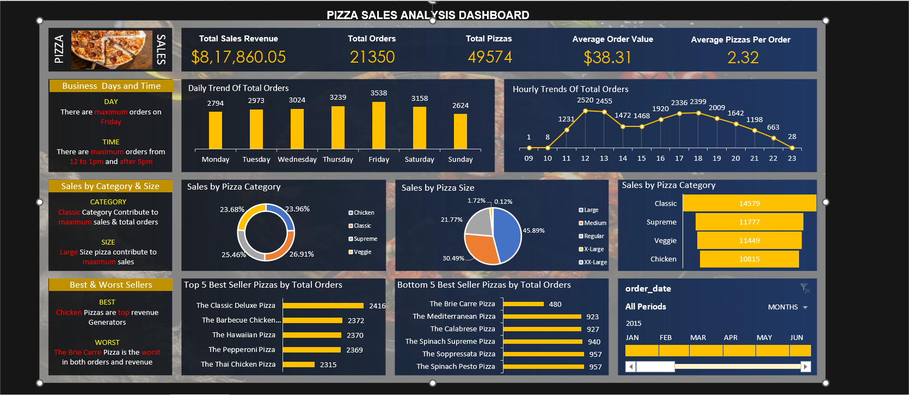

# 🍕 Pizza Sales Analysis

  
*Comprehensive SQL + Excel Analysis of Pizza Store Sales Data*

---

## 📘 Table of Contents
- [Introduction](#introduction)
- [Dataset Overview](#dataset-overview)
- [Project Objectives](#project-objectives)
- [SQL Analysis Breakdown](#sql-analysis-breakdown)
- [Visual Insights](#visual-insights)
- [Installation](#installation)
- [Usage](#usage)
- [Results Summary](#results-summary)
- [Technologies Used](#technologies-used)
- [Troubleshooting](#troubleshooting)
- [Contributors](#contributors)
- [License](#license)

---

## 🧠 Introduction
This project performs an **end-to-end analysis** of pizza sales data using **SQL** and **Excel** to uncover key business insights such as:
- Total revenue generation  
- Average order value  
- Popular pizza categories and sizes  
- Peak order hours  

The analysis helps restaurant owners make **data-driven decisions** to improve sales, menu offerings, and customer satisfaction.

---

## 📊 Dataset Overview

**Source:** `pizza-sales-analysis.xlsx`  
**Main Table:** `pizza_sales`  

| Column | Description |
|---------|-------------|
| `order_id` | Unique identifier for each customer order |
| `pizza_id` | Unique pizza identifier |
| `pizza_name` | Name of the pizza sold |
| `pizza_category` | Category (e.g., Classic, Supreme, Veggie, Chicken) |
| `pizza_Regularize` | Pizza size (Small, Medium, Large, etc.) |
| `quantity` | Number of pizzas sold per order |
| `unit_price` | Price of a single pizza |
| `total_price` | Total price per order line |
| `order_date` | Date of the order |
| `order_time` | Time when the order was placed |
| `day` | Day of the week |

---

## 🎯 Project Objectives
1. Compute **total sales revenue** and **average order value**.  
2. Identify **top-performing pizzas** and **popular sizes**.  
3. Determine **peak order hours** for staffing optimization.  
4. Visualize **category-wise and time-based sales trends**.  

---

## 🧮 SQL Analysis Breakdown

The file **`pizza-analysis.sql`** includes several analytical queries:

| Query | Description |
|--------|-------------|
| `SELECT TOP 10 * FROM pizza_sales` | Preview of the dataset |
| `SUM(total_price)` | Calculates total revenue |
| `SUM(total_price)/COUNT(DISTINCT order_id)` | Average order value |
| `GROUP BY DATEPART(hour, order_time)` | Orders grouped by hour |
| `GROUP BY pizza_size` | Orders grouped by pizza size |
| `GROUP BY pizza_name` | Top-selling pizzas by name |

---

## 📈 Visual Insights




---

## ⚙️ Installation

1. **Clone the Repository**
   ```bash
   git clone https://github.com/yourusername/pizza-sales-analysis.git
   cd pizza-sales-analysis

2. **Run the Analysis**
    <ul>
    <li>Load the Excel file (pizza-sales-analysis.xlsx)</li>
    <li>Execute SQL queries (pizza-analysis.sql) using a SQL environment</li>
    <li>Visualize charts using Excel</li>
    </ul>
    
3.  **Usage**
  <ol>
  <li>Import pizza-sales-analysis.xlsx into SQL.</li>
  <li>Run the SQL script pizza-analysis.sql to compute KPIs.</li>
  <li>Open the charts (generated .png files) for visualization.</li>
  <li>Modify queries to suit your custom pizza dataset.</li>
  </ol>

---

## Result Summary
| Metric                  | Value    |
| ----------------------- | -------- |
| **Total Revenue**       | $817,860 |
| **Total Orders**        | 21,350   |
| **Total Pizzas Sold**   | 49,574   |
| **Average Order Value** | $38.31   |
| **Pizzas per Order**    | 2.32     |
